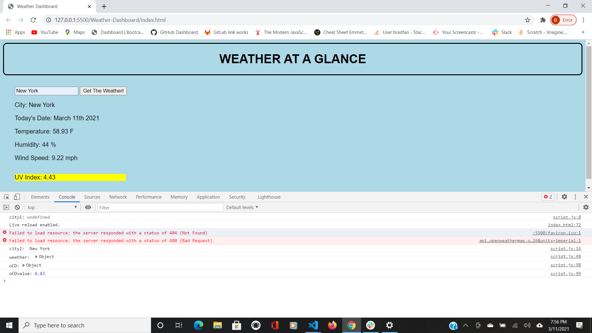

# Weather-Dashboard
GIVEN a weather dashboard with form inputs:
When the user searches for a city, they arepresented with current and future conditions for that city and that city is added to the search history.When they view current weather conditions for that city,they are presented with the city name, the date, an icon representation of weather conditions, the temperature, the humidity, the wind speed, and the UV index.When they view the UV index, they are presented with a color that indicates whether the conditions are favorable, moderate, or severe. When they view future weather conditions for that city, they are presented with a 5-day forecast that displays the date, an icon representation of weather conditions, the temperature, and the humidity.When they click on a city in the search history, they are again presented with current and future conditions for that city.

The Instructor and the TA's were instrumental in the completion of this assignment. Collaberation between the students is becoming more and more effective as we become more familiar with the work. I find the terms are easier to understand and I spend less time searching for information on the internet. I tend to use W3 Schools, MDN and and https://javascript.info/. 

This package contains index.html, script.js, style.css, dashboard.png. There are three API's accessed for this application.

