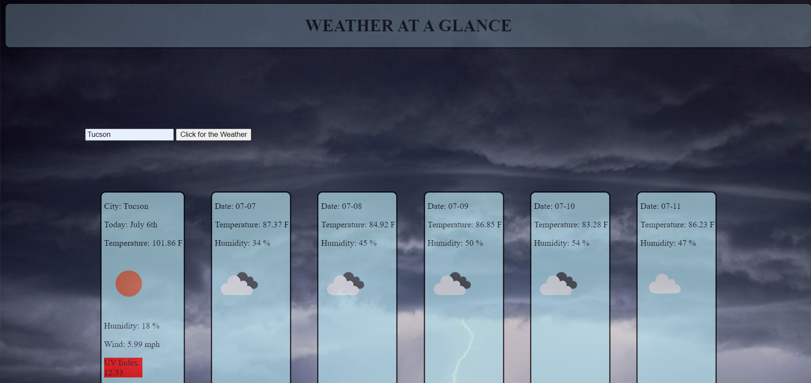

# Weather-Dashboard

* Github Repository Link: https://github.com/bradfan/Weather-Dashboard

* Deployed Application Link: https://bradfan.github.io/Weather-Dashboard/

 This weather app allows the user to access current and forecast weather data for a city of their choosing. It is responsive to all sizes of screens from desktops to mobile phones. This was originally created as a homework assignmnet for bootcamp and is constantly changing as I hone my skills.

This package contains html, javascript, css, dashboard.png, moment and two separate API calls.

